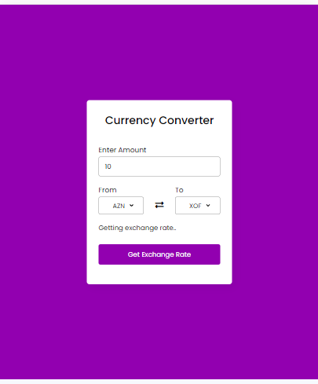

# Django-Currency-Converter
  forex-python 1.8
  Django


Django Currency Converter is a web application that allows users to convert currencies using the `forex-python` library. This README provides an overview of the project and instructions for setting it up and running it locally.

## Features
 
- Currency conversion between a wide range of currencies.
- Historical exchange rate data retrieval.
- User-friendly web interface.
- Customizable settings for currency conversion.

## Prerequisites

Before you begin, ensure you have met the following requirements:

- Python 3.x installed on your system.
- Django installed (you can install it using `pip install Django`).
- pip install forex-python

## Getting Started

To get started with this project, follow these steps:

1. Clone this repository to your local machine:

   ```shell
   git clone https://github.com/Princeroy1/Django-Currency-Converter


cd django-currency-converter


pip install -r requirements.txt


python manage.py runserver

## Contact
https://github.com/Princeroy1/Django-Currency-Converter, Abdul Rouf, and abdulrouf8010@gmail.com 

